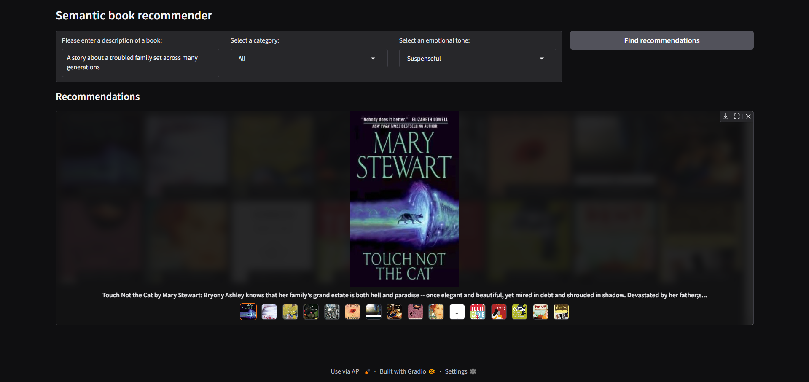

# Semantic Book Recommender

## Project Overview
The Semantic Book Recommender is an advanced recommendation system that uses natural language processing (NLP) and large language models (LLMs) to help users discover books based on semantic search, emotional tone, and category preferences. The system goes beyond traditional keyword matching by understanding the meaning and context behind user queries.

Key features include:
* **Semantic Search**: Find books similar to natural language queries (e.g., "a book about revenge")
* **Category Filtering**: Filter recommendations by fiction/non-fiction categories
* **Emotional Tone Analysis**: Sort books by emotional tones (happy, surprising, angry, suspenseful, sad)
* **Interactive UI**: User-friendly interface for exploring book recommendations

## Project Workflow
* **Text Data Cleaning**: Preprocess text data (`data-exploration.ipynb`)
* **Semantic Search**: Build a vector database for finding semantically similar books (`vector-search.ipynb`)
* **Text Classification**: Use zero-shot classification to label books by category (`text-classification.ipynb`)
* **Sentiment Analysis**: Analyze emotional tones using LLMs (`sentiment-analysis.ipynb`)
* **Web Application**: Interactive book recommendation interface with Gradio (`gradio-dashboard.py`)

## Technologies Used
* Python 3.11  
* Pandas  
* NumPy  
* Matplotlib  
* Seaborn  
* Chroma DB  
* LangChain  
* PyTorch  
* Transformers  
* Gradio  
* Jupyter Notebooks

## Dataset
This project uses the [7K Books with Metadata dataset](https://www.kaggle.com/datasets/dylanjcastillo/7k-books-with-metadata) from Kaggle, which contains approximately 7,000 books with rich metadata.

## LLM Models Used
The project leverages several AI models through LangChain integrations:
* **OpenAI Embeddings**: For semantic text representation and similarity search
* **Text Classification**: [facebook/bart-large-mnli](https://huggingface.co/facebook/bart-large-mnli) for zero-shot classification of books into fiction/non-fiction categories
* **Sentiment Analysis**: [j-hartmann/emotion-english-distilroberta-base](https://huggingface.co/j-hartmann/emotion-english-distilroberta-base) for emotional tone extraction from book descriptions

## Results
The system creates an intuitive book recommendation interface that allows users to discover books based on natural language queries, categories, and emotional tones.



## Installation and Usage

### Prerequisites
* Python 3.11 or higher
* OpenAI API key

### Installation

```bash
# Clone the repository
git clone https://github.com/yourusername/Semantic_Book_Recommender.git
cd Semantic_Book_Recommender

# Create and activate a virtual environment (optional but recommended)
python -m venv .venv
# On Windows
.venv\Scripts\activate
# On macOS/Linux
source .venv/bin/activate

# Install dependencies
pip install -r requirements.txt
```

### Environment Setup
Create a `.env` file in the project root directory with your OpenAI API key:
```
OPENAI_API_KEY=your_api_key_here
```

### Data Processing
Run the Jupyter notebooks in the following order to process the data:
1. `data-exploration.ipynb` - Data cleaning and preprocessing
2. `vector-search.ipynb` - Create vector embeddings for semantic search
3. `text-classification.ipynb` - Categorize books
4. `sentiment-analysis.ipynb` - Analyze emotional tones

### Running the Web Interface
```bash
python gradio-dashboard.py
```
The interface will be available at `http://127.0.0.1:7860` by default.

### Using the Recommender
1. Enter a natural language description of the book you're looking for
2. Select a category filter (optional)
3. Choose an emotional tone preference (optional)
4. Click "Find recommendations" to see book suggestions